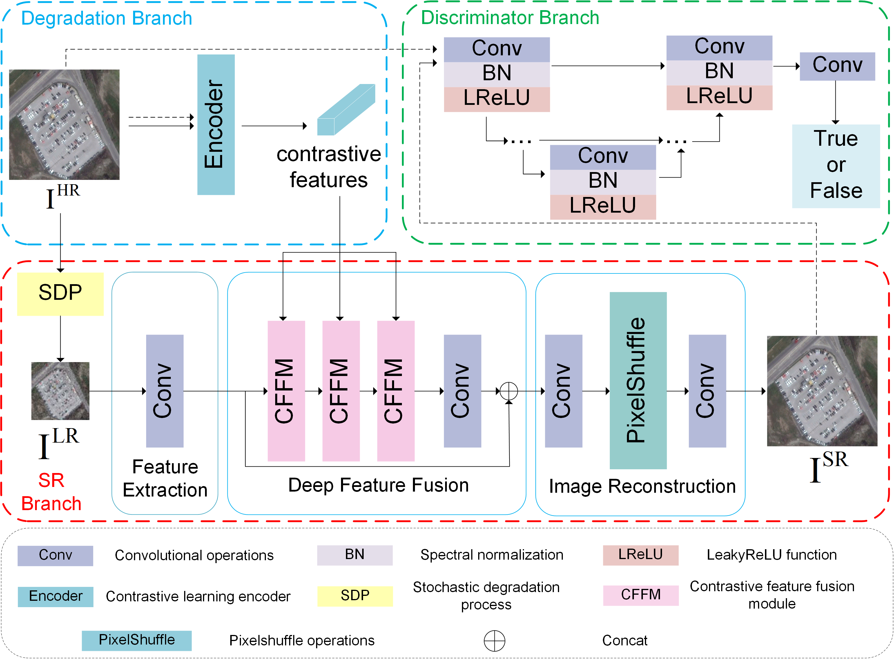

# EasySR

🚩 This repository aims to provide a large number of super-resolution methods for comparative experiments. Compared to other public repositories, our advantages include:

* numberous methods
* support for super-resolution of large-scale remote sensing images

## 📖 A Sensor-agnostic Self-supervised Network with Stochastic Degradation for Real-World Remote Sensing Image Super-Resolution

## Network



## Experiments

🔥 AID dataset by bicubic downsampling


🔥 AID dataset by SDP


🔥 WHU-RS19 dataset


🔥 Sentinel-2 and Google


## ⚡ TODO

- ✅ added my repository introduction.
- update our training code and inference code.
- update our pretrained model soon.

## Python script

### Traing

### Inference

```sh
python inference.py
```

## 📧 Contact

If you have any question, please email `wuzhaoming21@mails.ucas.ac.cn`.
